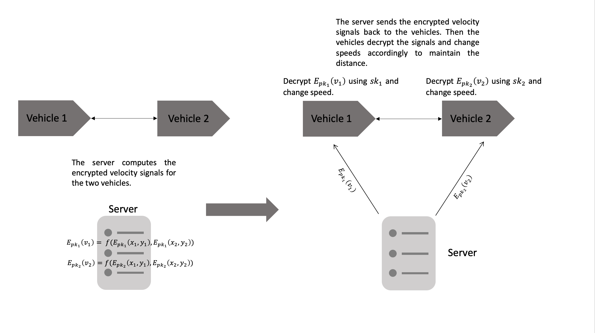

# Privacy-Preserving-Control-System-For-Intelligent-Vehicles

Reuters (2021) reported that Tesla cars are banned from China's military complexes on security concerns, which raises the discussions about privacy issues of the intelligent vehicles equipped with a variety of sensors. This project seeks to enable remote control of intelligent vehicles without breaching vehicle owners’ privacy by utilising homomorphic encryption. 

The proposed privacy-perserving control system for intelligent vehicles for Ford-Australia Alliance Australia Submitted Initial Project Idea.

## Detailed Process

Step 1 & 2.

Step 3 & 4.

